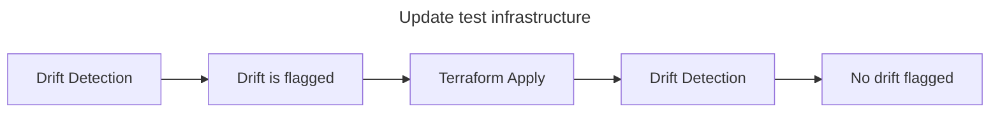

# Running the VPM PoV

This repository contains the Terraform configuration necessary to set up an environment to run the vulnerability patch management proof of value.

It is designed to work with the example Packer template repository ([hashicorp/autobahn-vpm-gha-packer](https://github.com/hashicorp/autobahn-vpm-gha-packer)) which will create and update the Packer images used to illustrate the VPM workflow.

This document explains how to set up an environment and how to run the PoV.

## Scenario objectives

The VPM scenario main objective is to:

* Demonstrate how you can use HCP Packer and HCP Terraform to quickly update deployed virtual machines after a vulnerabily is detected.

Additional objectives are to:

* Illustrate how to use infrastructure as code to manage HCP and HCP Terraform configuration.

## Scenario overview

The VPM scenario can be broken down into six sections:

1. Import the repositories in your VCS system.
2. Configure HCP and HCP Terraform.
3. Create the Packer images and update the HCP Packer channel configuration.
4. Deploy a test infrastructure using the Packer images.
5. Update the Packer images and update the HCP Packer channel configuration.
6. Validate that drift detection flags the drift and update the deployed test infrastructure with the new images.

## Import the repositories

The code necessary to run the VPM proof of value is contained in the following two repositories:

* [hashicorp/autobahn-vpm-pov](https://github.com/hashicorp/autobahn-vpm-pov)
* [hashicorp/autobahn-vpm-gha-packer](https://github.com/hashicorp/autobahn-vpm-gha-packer)

To share the code with a customer, download the most recent release ZIP file and send it to the customer.

The customer should then import the code into two distinct repositories in their version control system (VCS).

The VCS system must be accessible by HCP Terraform. In the case of a self-hosted VCS system, it may be necessary to use enhanced HCP Terraform agents (available only with HCP Terraform Premium). The instructions in this repository do not cover this situation, but if the customer must use enhanced HCP Terraform agents, additional time must be planned for the POV setup phase.

## Configure HCP and HCP Terraform

Once the code is imported in the repositories, the next step is to configure HCP and HCP Terraform. This step is documented here: [README](../README.md).

The code will create a separate HCP project for the HCP Packer instance. The PoV needs a number of HCP service principals and they will be project-scoped to avoid interfering with the IAM configuration of an existing HCP organization.

The code will also create a number of image buckets (one for each image template) and add a single channel to each bucket (the `production` channel).

## Create the Packer images

Once HCP and HCP Terraform are configured, the next steps is to create the Packer images. The repository [README](https://github.com/hashicorp/autobahn-vpm-gha-packer/blob/main/README.md) file contains the necessary information to perform this step.

The [hashicorp/autobahn-vpm-gha-packer](https://github.com/hashicorp/autobahn-vpm-gha-packer) code includes CI/CD configuration to automate the creation of the images. This configuration is designed for the GitHub Actions CI/CD solution. If the customer is using a different CI/CD system the pipeline configuration will have to be ported to that system. This effort needs to be factored in and additional time must be planned for the POV.

After the Packer images are created, you will need to assign the image version to the `production` channel. The Terraform code that deploys the test infrastructure "subscribes" to the `production` channel of the image buckets. If a image version is not assigned to the channel, the Terraform configuration will have to AMI id to use and the deployment will fail.

The test infrastructure is not deployed using the `latest` image bucket channel. This channel is managed by HCP Packer and is automatically updated to the newest unrevoked version available in the image bucket.

The `latest` channel includes the most recent builds, which may not have undergone extensive testing and validation. Customers should not deploy their infrastructure using the image version assigned to that channel.

## Deploy a test infrastructure

Once the Packer images are created and the `v1` version assigned to the `product` channel of the image buckets, the next step is to deploy the test infrastructure.

The [Configure HCP and HCP Terraform](#configure-hcp-and-hcp-terraform) step will have created a number of workspaces (`10` by default, but the number can be adjusted using a workspace variable) under the `vpm-pov` project. Those workspaces are "wired" to use the `production` channel of the image buckets set up initally.

Before running a `Terraform Apply` operation on each of those workspaces, you must ensure that the customer updated the HCP Terraform configuration to allow the workspaces to configure cloud infrastructure. This can be done a number of ways (static credentials, dynamic credentials, etc.) and can be configured at the workspace-level or the project-level (preferred).

When all the prerequisites are completed, execute the `Terraform Apply` on all the workspaces in the `vpm-pov` project. After the Apply operations are completed successfully, wait for the drift detection and health check runs to also complete and validate that no issues are reported.

## Update the Packer images

Once the test infrastructure is successfully deployed, the next step is to create a new version of the Packer images.

In a real-life scenario where the virtual machines are deployed from images tracked by HCP Packer, it is sometimes necessary to update the deployed infrastructure to address a security issue.

When a security issue is indentified, the first step is to create a new Packer image version fixing the security issue, perform the required tests to ensure there are no issues with the new image. Once these steps are completed, the affected image buckets can be updated: The corresponding channel (in the PoV example, it's the `production` channel) is assigned the newly created image version.

## Update the deployed test infrastructure

Once the Packer images are updated and the `v2` version assigned to the `product` channel of the image buckets, the next step is to redeploy the test infrastructure.

The workspaces used to deploy the test infrastructure all have health checks enabled. This means that on a regular basis HCP Terraform will run a job that does drift detection and validation checks, flagging any issue encountered.

Because the image version assigned to the bucket's `production` channel changed in the previous step, the next health check run will flag an issue: The drift detection report will report the drift, recommending to redeploy the infrastructure using the new virtual machine image.

In the context of the PoV you will need to manually trigger the health check run as the run frequency can be too long leading to a waste of time.

When the health check run is completed, access the drift detection report to confirm that the drift was indeed detected.

When this is confirmed, trigger a `Terraform Apply` in workspaces in the `vpm-pov` project and wait until successful execution: The virtual machines will be updated to use the new image.

When the workspaces have been updated, you may trigger a new health check to demonstrate that the drift detection report doesn't flag any issue.

## Next steps

At this point the key concepts behind vulnerability patch management using HCP Packer and HCP Terraform are understood and the customer team is ready to go through the same process, but using their own use-cases.

The repository can serve as a starting point to implement the customer's use cases on HCP Packer and HCP Terraform.
